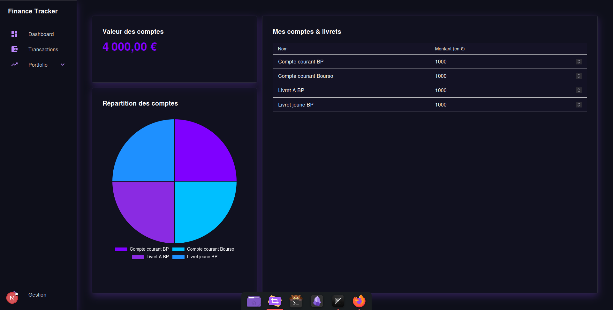
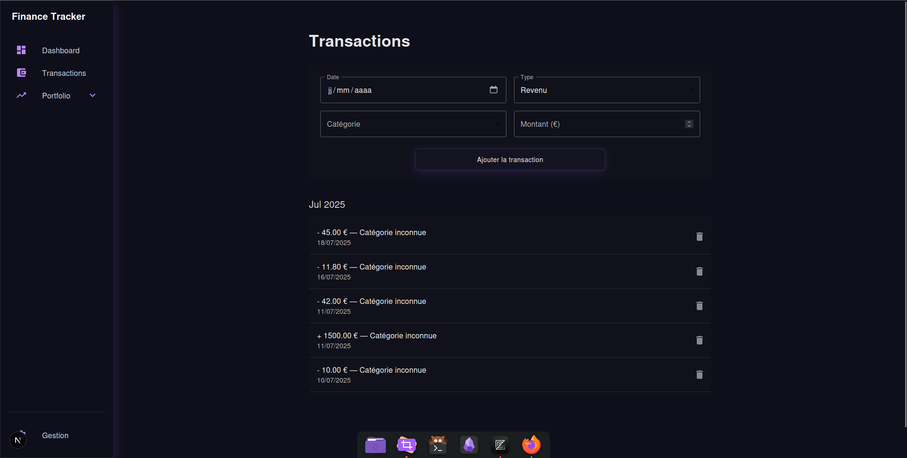

# Finance Tracker

**Finance Tracker** is a personal wealth management application that helps you monitor your assets, manage your finances, and track investments across different markets. The goal is to give you full visibility into your financial situation and identify optimization opportunities.

## Features

### Dashboard

The main dashboard provides a comprehensive overview of your financial status:

* **Net Worth Evolution**: Track how your wealth grows over time.
* **Monthly PnL**: Visualize your income and expenses across all accounts.
* **Portfolio Performance**: See the gains/losses of your **stock** and **crypto** investments.
* **Current Month Expense Breakdown**: A polar chart displays how your expenses are distributed among different categories.

### Presentation of different pages

#### Main page

#### Account page



#### Cryptocurrency page

#### Stock Market page

#### Transactions page



#### Config page

---

### Portfolio Section

Divided into 3 main pages:

1. **Accounts** – Monitor your various bank or investment accounts and their balance.
2. **Cryptocurrency** – Track your crypto assets with live price updates.
3. **Stock Market** – Track your stock investments, current prices, and PnL.

**Live data integration**:

* **Crypto prices** are fetched from [CoinGecko](https://www.coingecko.com/)
* **Stock prices** are fetched from [Yahoo Finance](https://finance.yahoo.com/)

This minimizes the need to input prices manually and ensures accurate performance tracking.

### Management Page

The **Gestion** page allows you to:

* Assign the correct **Yahoo Finance** or **CoinGecko** identifiers to each asset (stock or crypto)
* Prevent data mismatches or price tracking errors

## Tech Stack

* **Frontend**: Next.js (App Router), React, TypeScript
* **Styling**: Material UI (MUI)
* **Backend**: API routes with Prisma ORM
* **Database**: PostgreSQL
* **Charting**: Chart.js for data visualizations
* **External APIs**: Yahoo Finance, CoinGecko

## Getting Started

```bash
git clone ...
cd finance-tracker
npm install
npm run dev
```

Set up your environment variables (`.env`) with the appropriate credentials for database and APIs.

## Folder Structure

```bash
tree -d -I "node_modules"
```

```bash
├── app
│   ├── api
│   │   ├── categoriesTransaction
│   │   └── transactions
│   │       └── [id]
│   └── (pages)
│       ├── gestion
│       ├── portfolio
│       │   ├── bourse
│       │   │   └── _components
│       │   ├── compte
│       │   │   └── _components
│       │   └── cryptomonnaie
│       │       └── _components
│       └── transactions
│           └── _components
├── components
│   ├── Charts
│   │   ├── MainPage
│   │   │   ├── ExpensesPolarChart
│   │   │   └── WealthEvolutionChart
│   │   └── PieChart
│   ├── CustomButton
│   ├── CustomCard
│   └── Sidebar
├── core
│   ├── domain
│   │   └── finance
│   ├── ports
│   ├── services
│   └── use-cases
├── infrastructure
│   ├── config
│   ├── database
│   ├── orm
│   │   └── prisma
│   │       └── migrations
│   │           └── 20250725185038_init
│   ├── repositories
│   │   └── client
│   │       └── runtime
│   └── services
├── public
├── shared
│   └── types
└── styles
```
